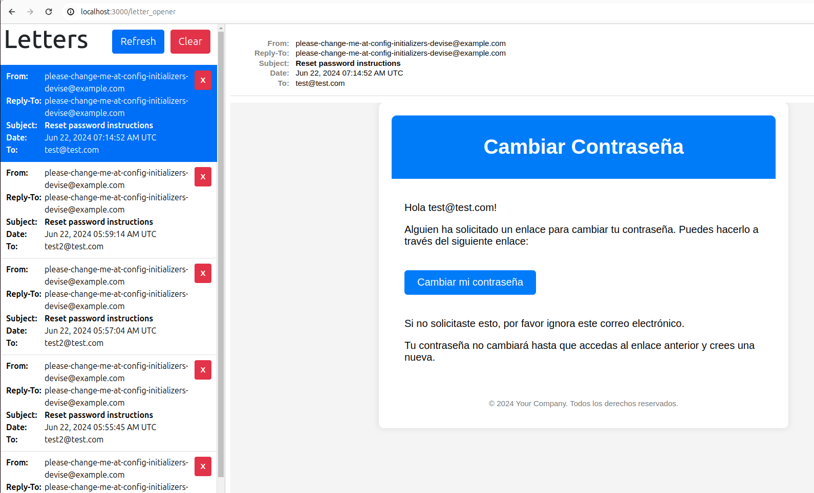

# README

# Lemontech Events
[](https://codeclimate.com/github/genesisgonza05/lemontech_events/maintainability)

Lemontech Events es una aplicación de gestión de eventos construida con Ruby on Rails y Docker, utilizando PostgreSQL como base de datos. Esta aplicación permite a los usuarios registrarse y autenticarse para gestionar sus eventos.

## Requisitos Previos

Asegúrate de tener instalados los siguientes programas en tu máquina:
- [Docker](https://www.docker.com/products/docker-desktop)
- [Docker Compose](https://docs.docker.com/compose/install/)

## Para levantar la aplicación por primera vez

Sigue estos pasos para configurar y levantar la aplicación por primera vez:

### 1. Clonar el Repositorio

```sh
git clone https://github.com/PENDIENTE/lemontech_events.git
cd lemontech_events
```

### 2. Construir y Levantar los Contenedores de Docker
```sh
docker-compose up -d
```

### 3. Crear y Migrar la Base de Datos
```sh
docker-compose run web rake db:create
docker-compose run web rake db:migrate
docker-compose run web rake db:seed
```

## Levantar la aplicación frecuentemente

Una vez que has hecho la configuración inicial, puedes levantar la aplicación frecuentemente con:

```sh
docker-compose up
```

Para detener los contenedores:
```sh
docker-compose down
```

## Ejecutar Pruebas

Para ejecutar las pruebas de Rspec (Unitarias):
```sh
docker-compose run test rspec
```

Para ejecutar las pruebas de Cucumber (de Integración):
```sh
docker-compose run test cucumber
```

## Estructura del Proyecto

```sh
lemontech_events/
	├── app/
	├── bin/
	├── config/
	├── db/
	├── docker-compose.yml
	├── Dockerfile
	├── Gemfile
	├── Gemfile.lock
	├── lib/
	├── log/
	├── public/
	├── README.md
	├── storage/
	├── test/
	└── tmp/
```

## Mailing

El proyecto cuenta con revision de emails con letter_opener_web en el ambiente de desarrollo, si deseas ver los emails enviados en tu entorno de desarrollo tan solo entra al siguiente enlace:



